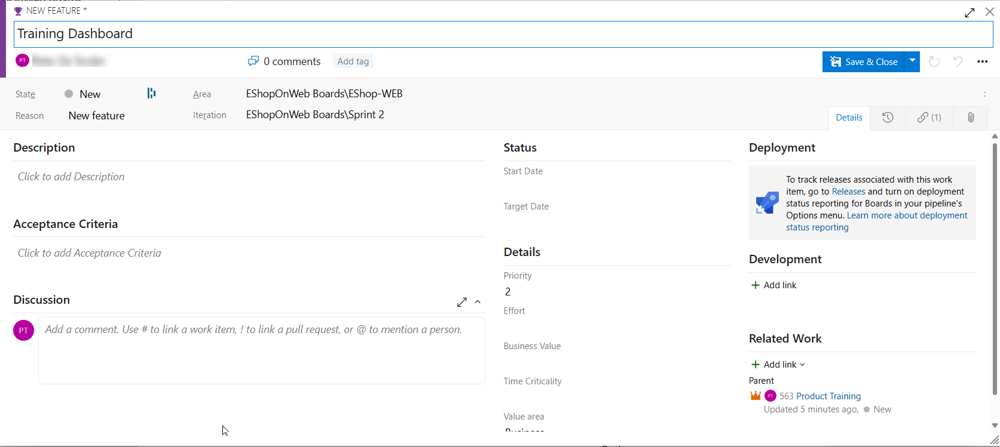
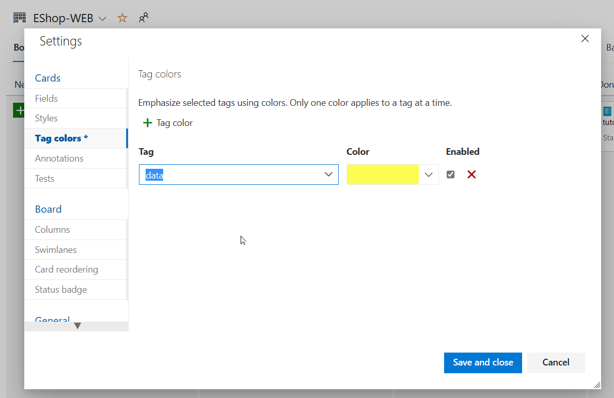
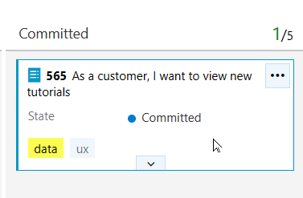

---
lab:
  title: Azure Boards를 사용하여 Agile 계획 및 포트폴리오 관리
  module: 'Module 01: Get started on a DevOps transformation journey'
---

# Azure Boards를 사용하여 Agile 계획 및 포트폴리오 관리

# 학생용 랩 매뉴얼

## 랩 요구 사항

- 이 랩은 **Microsoft Edge** 또는 [Azure DevOps 지원 브라우저](https://docs.microsoft.com/en-us/azure/devops/server/compatibility?view=azure-devops#web-portal-supported-browsers)가 필요합니다.

- **Azure DevOps 조직 설정:** 이 랩에 사용할 수 있는 Azure DevOps 조직이 아직 없으면 [조직 또는 프로젝트 컬렉션 만들기](https://docs.microsoft.com/en-us/azure/devops/organizations/accounts/create-organization?view=azure-devops)에서 제공되는 지침에 따라 조직을 만듭니다.

## 랩 개요

이 랩에서는 Azure Boards에서 제공하는 Agile 계획 및 포트폴리오 관리 도구와 프로세스에 대해 알아봅니다. 또한 전체 팀에서 이러한 도구 및 프로세스를 활용하여 작업을 신속하게 계획, 관리 및 추적할 수 있는 방법도 살펴봅니다. 반복 도중 작업 흐름을 추적할 수 있는 제품 백로그, 스프린트 백로그 및 작업 보드를 살펴봅니다. 또한 이 릴리스에서 대규모 팀 및 조직으로 확장되도록 향상된 도구도 살펴보겠습니다.

## 목표

이 랩을 완료하면 다음 작업을 수행할 수 있습니다.

- 팀, 영역 및 반복 관리.
- 작업 항목을 관리합니다.
- 스프린트 및 수용작업량 관리.
- Kanban 보드 사용자 지정.
- 대시보드 정의.
- 팀 프로세스 사용자 지정.

## 예상 소요 시간: 60분

## Instructions

### 연습 0: 랩 필수 구성 요소 구성

> **참고**: 이전 랩에서 이 프로젝트를 이미 만든 경우 이 연습을 건너뛸 수 있습니다.

이 연습에서는 랩의 필수 구성 요소를 설정합니다. 구체적으로는 [eShopOnWeb](https://github.com/MicrosoftLearning/eShopOnWeb)을 기반으로 하여 새 Azure DevOps 프로젝트와 리포지토리를 설정합니다.

#### 작업 1: (이미 완료된 경우 건너뛰기) 팀 프로젝트 만들기 및 구성

이 작업에서는 여러 랩에서 사용할 **eShopOnWeb** Azure DevOps 프로젝트를 만듭니다.

1. 랩 컴퓨터의 브라우저 창에서 Azure DevOps 조직을 엽니다. **새 프로젝트**를 클릭합니다. 프로젝트에 **eShopOnWeb**이라는 이름을 지정합니다. **Private**을 표시 유형 옵션으로 정의합니다.
2. **고급**을 클릭하고 **스크럼**을 **작업 항목 프로세스**로 지정합니다.
 **만들기**를 클릭합니다.

    

### 연습 1: Agile 프로젝트 관리

이 연습에서는 Azure Boards를 사용하여 몇 가지 일반적인 Agile 계획 및 포트폴리오 관리 작업을 수행합니다. 구체적으로는 팀, 영역, 반복, 작업 항목, 스프린트, 수용작업량 관리, Kanban 보드 사용자 지정, 대시보드 정의, 팀 프로세스 사용자 지정 등을 수행합니다.

#### 작업 1: 팀, 영역 및 반복 관리

이 작업에서는 새 팀을 만들고 팀의 영역 및 반복을 구성합니다.

각 새 프로젝트는 기본 팀으로 구성되며 기본 팀의 이름은 프로젝트 이름과 일치합니다. 팀을 추가로 만들 수도 있습니다. 각 팀에는 Agile 도구 및 팀 자산 모음에 대한 액세스 권한을 부여할 수 있습니다. 여러 팀을 만들 수 있으므로 팀이 자율적으로 업무를 진행하도록 하는 동시에 기업 전반에서 공동 작업도 수행하도록 적절한 옵션을 유동적으로 선택할 수 있습니다.

1. 웹 브라우저가 이전 연습에서 생성한 **EShopOnWeb** 프로젝트를 사용하여 Azure DevOps organization 표시하는지 확인합니다.

    > **참고**: 또는 자리 표시자가 계정 이름을 나타내는 [<https://dev.azure.com/>`<your-Azure-DevOps-account-name>`/EShopOnWeb) URL `<your-Azure-DevOps-account-name>` 로 이동하여 프로젝트 페이지에 직접 액세스할 수 있습니다.

2. 페이지 왼쪽 아래에 있는 레이블이 **프로젝트 설정**인 톱니바퀴 모양 아이콘을 클릭하여 **프로젝트 설정** 페이지를 엽니다.

    

3. **일반** 섹션에서 **Teams** 탭을 선택합니다. 이 프로젝트에는 **EShopOnWeb 팀**이라는 기본 팀이 이미 있지만 이 랩에 대한 새 팀을 만듭니다. **새 팀**을 클릭합니다.

    

4. **새 팀 만들기** 창의 **팀 이름** 텍스트 상자에 **EShop-Web**을 입력하고 다른 설정을 기본값으로 그대로 두고 **만들기**를 클릭합니다.

    

5. **팀** 목록에서 새로 만든 팀을 선택하여 해당 세부 정보를 확인합니다.

    > **참고**: 새 팀에는 기본적으로 팀을 만든 사람만 구성원으로 포함됩니다. 이 보기를 사용해 팀 구성원 자격, 알림, 대시보드 등의 기능을 관리할 수 있습니다.

6. **EShop-Web** 페이지 맨 위에 있는 **반복 및 영역 경로** 링크를 클릭하여 팀의 일정 및 scope 정의하기 시작합니다.

    

7. **Boards** 창 위쪽에서 **반복**을 선택하고 **+ 반복 선택**을 클릭합니다.

    

8. **EShopOnWeb\Sprint 1**을 선택하고 **저장 및 닫기를** 클릭합니다. 이 첫 번째 스프린트는 반복 목록에 표시되지만 날짜는 아직 설정되지 않았습니다.
9. **스프린트 1**을 선택하고 **줄임표(...)** 를 클릭합니다. 상황에 맞는 메뉴에서 **편집**을 선택합니다.

     

    > **참고**: 시작 날짜를 지난 주의 첫 번째 작업일로 지정하고 각 스프린트의 전체 작업 주 3주를 계산합니다. 예를 들어 3월 6일이 스프린트의 첫 번째 작업일인 경우 3월 24일까지 진행됩니다. 스프린트 2는 3월 6일부터 3주 후인 3월 27일에 시작됩니다.

10. 이전 단계를 반복하여 **스프린트 2**와 **스프린트 3**을 추가합니다. 현재 첫 스프린트 2주차에 있다고 말할 수 있습니다.

    

11. **Boards** 창으로 돌아온 다음 창 위쪽에서 **영역** 탭을 선택합니다. 이 탭에는 이름이 팀 이름과 일치하는 자동 생성된 영역이 있습니다.
12. **기본 영역** 항목 옆에 있는 줄임표 기호(...)를 클릭하고 드롭다운 목록에서 **하위 영역 포함**을 선택합니다.

    

    > **참고**: 모든 팀의 기본 설정에서는 하위 영역 경로가 제외됩니다. 여기서는 팀이 모든 팀의 작업 항목을 모두 확인할 수 있도록 기본 설정을 변경하여 하위 영역을 포함합니다. 관리 팀은 필요에 따라 하위 영역을 포함하지 않도록 선택할 수도 있습니다. 그러면 작업 항목이 팀 중 하나에 할당되는 즉시 관리 팀 보기에서 자동으로 제거됩니다.

#### 작업 2: 작업 항목 관리

이 작업에서는 일반적인 작업 항목 관리 작업을 단계별로 진행합니다.

작업 항목은 Azure DevOps의 중요한 구성 요소입니다. 수행할 작업 설명, 릴리스 관련 제한, 테스트 정의, 기타 주요 항목 등으로 사용되는 작업 항목은 최신 방식으로 진행되는 프로젝트에서 가장 활용도가 높은 요소라 할 수 있습니다. 이 작업에서는 다양한 작업 항목을 사용해 제품 교육 섹션을 포함하도록 Parts Unlimited 사이트를 확장하는 계획 설정 과정을 중점적으로 진행합니다. 회사의 제품에서 이처럼 중요한 부분을 설정하는 과정은 쉽지 않을 수도 있지만, Azure DevOps와 스크럼 프로세스를 활용하면 이 과정을 매우 쉽게 관리할 수 있습니다.

> **참고**: 이 작업에서는 다양한 작업 항목 종류를 만드는 여러 가지 방식을 제시하는 동시에, 플랫폼에서 사용할 수 있는 광범위한 기능도 설명합니다. 그러므로 이 작업에서 진행하는 단계를 프로젝트 관리 방식을 규정하는 지침으로 간주해서는 안 됩니다. 이러한 기능은 프로세스의 요구에 맞게 유동적으로 활용할 수 있으므로 실제 활용 상황에 맞도록 다양하게 적용해 보시기 바랍니다.

1. Azure DevOps 포털의 세로 탐색 창에서 **Repos** 아이콘을 선택하고 **작업 항목**을 선택합니다.

    > **참고**: Azure DevOps에서는 여러 가지 방법으로 작업 항목을 만들 수 있습니다. 여기서는 그 중 몇 가지를 살펴봅니다. 대시보드에서 작업 항목을 시작만 하면 되는 경우도 있습니다.

2. **작업 항목** 창에서 **+ 새 작업 항목 > 대규모 사용자 스토리**를 클릭합니다.

    

3. **제목 입력** 텍스트 상자에 **제품 교육**을 입력합니다.
4. 왼쪽 위에서 **할당되지 않음** 항목을 선택하고 드롭다운 목록에서 자신의 사용자 계정을 선택하여 자신에게 새 작업 항목을 할당합니다.
5. **영역** 항목 옆에 있는 **eShopOnWeb** 항목을 선택하고 드롭다운 목록에서 **EShop-WEB**을 선택합니다. 그러면 **영역** 이 **eShopOnWeb\EShop-WEB으로** 설정됩니다.
6. **반복** 항목 옆에 있는 **eShopOnWeb** 항목을 선택하고 드롭다운 목록에서 **스프린트 2**를 선택합니다. 그러면 **반복** 이 **eShopOnWeb\Sprint 2**로 설정됩니다.
7. **저장** 을 클릭하여 변경을 마무리합니다. **창을 닫지 마세요**.

    

    > **참고**: 일반적으로는 최대한 많은 정보를 입력해야 하지만 이 랩에서는 이 정도만 입력해도 충분합니다.

    > **참고**: 이 작업 항목 양식에는 관련 작업 항목 설정이 모두 포함되어 있습니다. 구체적으로는 작업 항목 할당 대상 관련 세부 정보, 작업 항목 상태(여러 매개 변수 포함), 그리고 작업 항목이 생성된 이후 처리된 방식과 관련된 모든 정보와 기록이 포함됩니다. 그 중에서 특히 자세하게 확인해야 하는 부분 중 하나가 **관련 작업**입니다. 여기서는 이 대규모 사용자 스토리에 기능을 추가하는 한 가지 방법을 살펴보겠습니다.

8. 오른쪽 **관련 작업** 섹션에서 **링크 추가** 항목을 선택하고 드롭다운 목록에서 **새 항목**을 선택합니다.
9. **링크 추가** 패널의 **링크 유형** 드롭다운 목록에서 **자식** 을 선택합니다. 그런 다음 **작업 항목 유형** 드롭다운 목록에서 **기능을** 선택하고 **제목** 텍스트 상자에 **학습 dashboard** 입력하고 **확인을** 클릭합니다.

    

    > **참고**: **교육 대시보드** 창에서 할당 항목인 **영역** 및 **반복**은 추가하려는 기능의 기준으로 사용되는 대규모 사용자 스토리와 같은 값으로 이미 설정되어 있습니다. 그리고 기능은 기능 생성 시에 사용했던 상위 항목에 자동으로 연결되어 있습니다.

10. **교육 대시보드** 창에서 **저장 후 닫기**를 클릭합니다.

11. Azure DevOps 포털의 세로 탐색 창에 있는 **Boards** 항목 목록에서 **Boards**를 선택합니다.
12. **보드** 패널에서 **EShop-WEB 보드** 항목을 선택합니다. 그러면 해당 팀의 보드가 열립니다.

    

13. **Boards** 패널 오른쪽 위에서 **백로그 항목**을 선택하고 드롭다운 목록에서 **기능**을 선택합니다.

    > **참고**: 이 단계를 수행하면 기능에 작업 및 기타 작업 항목을 쉽게 추가할 수 있습니다.

14. **교육 대시보드** 기능을 나타내는 사각형 위에 마우스 포인터를 올립니다. 그러면 오른쪽 위 모서리에 줄임표 기호(...)가 표시됩니다.
15. 줄임표(...) 아이콘을 클릭하고 드롭다운 목록에서 **제품 백로그 항목 추가를** 선택합니다.

    

16. 새 제품 백로그 항목 텍스트 상자에 **고객용 신규 자습서 확인 요망**을 입력하고 **Enter** 키를 눌러 항목을 저장합니다.

    > **참고**: 이 단계를 수행하면 해당 기능의 하위 항목이며 기능의 영역과 반복을 공유하는 새 PBI(제품 백로그 항목) 작업 항목이 작성됩니다.

17. 이전 단계를 반복하여 PBI 2개를 더 추가합니다. 구체적으로는 고객이 최근 살펴본 자습서를 확인할 수 있는 PBI인 **최근 보았던 자습서 확인 요망**과 새 자습서를 요청하는 PBI인 **고객용 신규 자습서 요청**를 추가합니다.

    

18. **Boards** 창 오른쪽 위에서 **기능** 항목을 선택하고 드롭다운 목록에서 **백로그 항목**을 선택합니다.

     

    > **참고**: 백로그 항목에는 완료율을 정의하는 상태가 표시됩니다. 양식을 사용하여 작업 항목을 열어서 편집할 수도 있지만 카드를 보드에 끌어서 놓는 방식이 더 쉽습니다.

19. **EShop-WEB** 패널의 **보드** 탭에서 고객으로 라는 첫 번째 작업 항목을 끌어 새 **자습서를** **새로** 만들기에서 **승인됨** 단계로 봅니다.

    

    > **참고**: 작업 항목 카드를 확장하면 편집 가능한 세부 정보를 편리하게 확인할 수 있습니다.

20. **승인됨** 단계로 이동한 작업 항목을 나타내는 사각형 위에 마우스 포인터를 올립니다. 그러면 아래쪽 캐럿 기호가 표시됩니다.
21. 아래쪽 캐럿 기호를 클릭하여 작업 항목 카드를 확장하고 **할당되지 않음** 항목을 선택한 다음 사용자 계정 목록에서 자신의 계정을 선택하여 이동한 PBI를 자신에게 할당합니다.
22. **EShop-WEB** 패널의 **보드** 탭에서 고객으로서 라는 두 번째 작업 항목을 끌어서 최근에 **새로** 만들기에서 **커밋**된 스테이지로 **본 자습서를 확인하려고** 합니다.
23. **EShop-WEB** 패널의 **보드** 탭에서 **고객으로서 새 자습서를** **새로** 만들기 단계에서 **완료** 단계로 요청하려는 세 번째 작업 항목을 끕니다.

    

    > **참고**: 작업 보드는 백로그를 확인할 수 있는 보기 중 하나입니다. 테이블 형식 보기를 사용할 수도 있습니다.

24. **EShop-WEB** 창의 **보드** 탭에서 창 위쪽에서 **백로그로 보기를** 클릭하여 테이블 형식 양식을 표시합니다.

    

    > **참고**: **EShop-WEB** 패널의 **백로그** 탭 레이블 바로 아래에 있는 더하기 기호를 사용하여 이러한 작업 항목 아래에 중첩된 작업을 볼 수 있습니다.

    > **참고**: 첫 번째 백로그 항목 바로 왼쪽의 두 번째 더하기 기호를 사용하면 해당 항목에 새 작업을 추가할 수 있습니다.

25. **EShop-WEB** 창의 **백로그** 탭에서 창의 왼쪽 위 모서리에서 첫 번째 작업 항목 옆에 있는 두 번째 더하기 기호를 클릭합니다. 그러면 **새 작업** 창이 표시됩니다.

    

26. **새 작업** 창 위쪽의 **제목 입력** 텍스트 상자에 **최신 자습서용 페이지 추가**를 입력합니다.
27. **새 작업** 창의 **남은 작업 시간** 텍스트 상자에 **5**를 입력합니다.
28. **새 작업** 창의 **활동**드롭다운 목록에서 **개발**을 선택합니다.
29. **새 작업** 창에서 **저장 후 닫기**를 클릭합니다.

    

30. 마지막 5개 단계를 반복하여 **최신 자습서용으로 데이터 쿼리 최적화 작업**을 더 추가합니다. **남은 작업 시간**은 **3**으로, **활동**은 **디자인**으로 설정합니다. 작업을 완료한 후 **저장 후 닫기**를 클릭합니다.

#### 작업 3: 스프린트 및 수용작업량 관리

이 작업에서는 일반적인 스프린트 및 수용작업량 관리 작업을 단계별로 진행합니다.

팀은 대개 스프린트 첫날에 진행되는 스프린트 계획 회의에서 스프린트 백로그를 작성합니다. 각 스프린트는 팀이 Agile 프로세스와 도구를 사용하여 작업을 수행할 수 있는 일정한 간격에 해당합니다. 계획 회의에서는 제품 소유자가 팀과 협의하여 스프린트에서 완료할 스토리나 백로그 항목을 파악합니다.

계획 회의는 보통 두 부분으로 구분할 수 있습니다. 첫 부분에서는 팀과 제품 소유자가 이전 스프린트 진행 경험을 토대로 하여 해당 스프린트에서 완료할 수 있다고 판단되는 백로그 항목을 파악합니다. 이러한 항목이 스프린트 백로그에 추가됩니다. 두 번째 부분에서는 팀이 각 항목을 개발 및 테스트할 방법을 결정합니다. 그리고 각 항목을 완료하려면 수행해야 하는 작업을 정의하고 예측합니다. 마지막으로 팀이 예측 정보에 따라 항목 중 일부나 모든 항목을 구현합니다.

스프린트 백로그에는 팀이 적절한 계획을 세워 스프린트가 거의 끝나 갈 때 서두르지 않고 할당된 시간 내에 작업을 완료하는 데 필요한 모든 정보를 포함해야 합니다. 스프린트를 계획하기 전에 백로그 작성, 우선 순위 설정, 예측과 스프린트 정의를 완료해야 합니다.

1. Azure DevOps 포털의 세로 탐색 창에서 **Boards** 아이콘을 선택하고 **Boards** 항목 목록에서 **스프린트**를 선택합니다.
2. **스프린트** 보기 **작업 보드** 탭의 도구 모음 오른쪽에서 깔때기 아이콘 바로 왼쪽에 있는 **보기 옵션** 기호를 선택하고 **보기 옵션** 드롭다운 목록에서 **작업 세부 정보** 항목을 선택합니다.

    

    > **참고**: 현재 스프린트는 범위가 매우 제한되어 있습니다. **할 일** 단계에는 작업이 2개 있습니다. 현재는 두 작업이 모두 할당되지 않은 상태입니다. 두 작업의 **할당되지 않음** 항목 오른쪽에는 남은 작업 시간 추정치를 나타내는 숫자 값이 표시됩니다.

3. **최신 자습서용 페이지 추가**를 나타내는 사각형에서 **할당되지 않음** 항목을 클릭하고 사용자 계정 목록에서 자신의 계정을 선택하여 작업을 자신에게 할당합니다.

4. **스프린트 보기**의 **수용작업량** 탭을 선택합니다.

    > **참고**: 이 보기에서는 사용자가 수행할 수 있는 활동과 해당 활동의 수용작업량 수준을 정의할 수 있습니다.

5. **스프린트** 보기 **수용작업량** 탭의 **활동** 레이블 바로 아래에 있는 **할당되지 않음** 드롭다운 목록에서 **개발**을 선택하고 **일별 수용작업량** 텍스트 상자에 **1**을 입력합니다.

    > **참고**: 이 값은 매일 개발 작업을 1시간 수행한다는 뜻입니다. 개발 이외의 작업도 수행해야 하는 경우에는 사용자당 활동을 더 추가할 수 있습니다.

    > **참고**: 휴가를 갈 예정이라고 가정하여 수용작업량을 설정해 보겠습니다.

6. **스프린트** 보기의 **수용작업량** 탭에서 사용자 계정을 나타내는 항목 바로 옆에 있는 **휴가** 열의 **0일** 항목을 클릭합니다. 그러면 휴가를 설정할 수 있는 창이 표시됩니다.
7. 표시된 창에서 달력 보기를 사용해 현재 스프린트 기간(다음 3주) 중 5일을 휴가로 설정합니다. 설정을 완료한 후 **확인**을 클릭합니다.

    

8. **스프린트** 보기의 **수용작업량** 탭으로 돌아와서 **저장**을 클릭합니다.
9. **스프린트** 보기의 **작업 보드** 탭을 선택합니다.

    

    > **참고**: 작업 가능한 시간이 반영되어 **작업 세부 정보** 창이 업데이트되었습니다. **작업 세부 정보** 창에 실제로 표시되는 값은 다를 수도 있습니다. 하지만 일별 수용작업량을 1시간으로 할당했으므로 스프린트의 총 수용작업량은 스프린트 종료 시까지 남은 작업 기간(일)과 일치합니다. 이 값은 이후 단계에서 사용할 것이므로 적어 두세요.

    > **참고**: 보드의 편리한 기능 중 하나는 주요 데이터를 인라인으로 업데이트할 수 있다는 것입니다. 그러므로 각 작업의 예상 기간을 반영하여 **남은 작업 시간** 추정치를 정기적으로 업데이트하는 것이 좋습니다. **최신 자습서용 페이지 추가** 작업을 검토한 결과 원래 예상보다 더 오래 걸릴 것으로 보인다고 가정해 보겠습니다.

10. **스프린트** 보기의 **작업보드** 탭에서 **가장 최근 자습서의 추가 페이지를** 나타내는 사각형 상자에서 이전 단계에서 식별한 이 스프린트의 총 용량과 일치하도록 예상 시간 수를 **14**로 설정합니다.

    

    > **참고**: 이 작업을 수행하면 **개발** 및 개인 수용작업량이 최대치까지 자동 확장됩니다. 이 수용작업량은 할당된 작업을 처리하기에 충분하므로 색은 녹색으로 유지됩니다. 그러나 **최신 자습서용 데이터 쿼리 최적화** 작업에 3시간이 더 필요하기 때문에 **팀**의 전체 수용작업량을 초과하게 됩니다.

    > **참고**: 수용작업량과 관련된 이 문제를 해결할 수 있는 방법 중 하나는 작업을 이후 반복으로 이동하는 것입니다. 몇 가지 방법을 사용할 수 있는데, 가령 여기서 작업을 열어 작업 세부 정보에 액세스할 수 있는 창 내에서 편집할 수 있습니다. 작업 이동을 위한 인라인 메뉴 옵션이 제공되는 **백로그** 보기를 사용할 수도 있습니다. 하지만 여기서는 아직 작업을 이동하지 않겠습니다.

11. **스프린트** 보기 **작업 보드** 탭의 도구 모음 오른쪽에서 깔때기 아이콘 바로 왼쪽에 있는 **보기 옵션** 기호를 선택하고 **보기 옵션** 드롭다운 목록에서 **사용자** 항목을 선택합니다.

    > **참고**: 그러면 백로그 항목이 아닌 사용자를 기준으로 작업 진행률을 검토할 수 있도록 보기가 조정됩니다.

    > **참고**: 다양한 설정을 사용자 지정할 수도 있습니다.

12. 깔때기 아이콘 바로 오른쪽에 있는 **팀 설정 구성** 톱니바퀴 아이콘을 클릭합니다.
13. **설정** 창에서 **스타일** 탭을 선택하고 **+ 스타일 지정 규칙**을 클릭한 다음 **규칙 이름** 레이블 아래의 **이름** 텍스트 상자에 **개발**을 입력합니다. 그런 다음 **카드 색** 드롭다운 목록에서 녹색 사각형을 선택합니다.

    > **참고**: 그러면 바로 아래의 **규칙 기준** 섹션에 설정된 규칙 기준을 설정하는 모든 카드가 녹색으로 표시됩니다.

14. **규칙 기준** 섹션의 **필드** 드롭다운 목록에서 **활동**을 선택하고 **연산자** 드롭다운 목록에서 **=** 를, **값** 드롭다운 목록에서 **개발**을 선택합니다.

    

    > **참고**: 그러면 **개발** 활동에 할당된 모든 카드가 녹색으로 설정됩니다.

15. **설정** 창에서 **백로그** 탭을 선택합니다.

    > **참고**: 이 탭의 항목을 사용하면 탐색에 사용 가능한 수준을 설정할 수 있습니다. 기본적으로 대규모 사용자 스토리는 포함되지 않지만 포함되도록 변경할 수 있습니다.

16. **설정** 창에서 **작업일** 탭을 선택합니다.

    > **참고**: 이 탭의 항목을 사용하면 팀에 적용되는 **작업일**을 지정할 수 있습니다. 작업일은 수용작업량 및 번다운(Burndown) 계산에 사용됩니다.

17. **설정** 창에서 **버그 작업** 탭을 선택합니다.

    > **참고**: 이 탭의 항목을 사용하면 보드에 버그가 표시되는 방식을 지정할 수 있습니다.

18. **설정** 패널에서 **저장 후 닫기**를 클릭하여 스타일 지정 규칙을 저장합니다.

    > **참고**: 이제 **개발** 관련 작업이 녹색으로 표시되므로 매우 쉽게 확인할 수 있습니다.

#### 작업 4: Kanban 보드 사용자 지정

이 작업에서는 Kanban 보드를 사용자 지정하는 프로세스를 단계별로 진행합니다.

팀이 고품질 소프트웨어를 일정하게 제공하는 능력을 최대한 높이기 위해 Kanban에서는 두 가지 주요 사례가 중점적으로 적용됩니다. 첫 번째 사례(작업 흐름 시각화)를 적용하려면 팀 워크플로 단계를 매핑하고 해당 단계에 일치하는 Kanban 보드를 구성해야 합니다. 두 번째 사례(진행 중인 작업량 제한)를 적용하려면 WIP(진행 중인 작업) 제한을 설정해야 합니다. 그러면 Kanban 보드에서 작업 진행률을 추적하고 주요 메트릭을 모니터링하여 지연 시간이나 주기 시간을 줄일 수 있습니다. Kanban 보드는 백로그를 대화형 게시판으로 전환하여 시각적 작업 흐름을 제공합니다. 아이디어 구상에서 제품 완성까지의 작업을 진행하는 과정에서 보드의 항목을 업데이트합니다. 각 열은 작업 단계를 나타내며 각 카드는 해당 작업 단계의 사용자 스토리(파란색 카드) 또는 버그(빨간색 카드)를 나타냅니다. 하지만 어떤 팀이든 장기적으로는 자체 프로세스를 개발하기 때문에 최종 결과물을 정상적으로 제공하려면 팀의 작업 방식과 일치하도록 Kanban 보드를 사용자 지정하는 기능이 반드시 필요합니다.

1. Azure DevOps 포털의 세로 탐색 창에 있는 **Boards** 항목 목록에서 **Boards**를 선택합니다.
2. **Boards** 창에서 깔때기 아이콘 바로 오른쪽에 있는 **팀 설정 구성** 톱니바퀴 아이콘을 클릭합니다.

    > **참고**: 팀에서는 데이터를 사용하여 작업을 완료해야 하므로 데이터 액세스 또는 저장과 관련한 작업을 철저하게 확인해야 합니다.

3. **설정** 창에서 **태그 색** 탭을 선택하고 **+ 태그 색**을 클릭합니다. 그런 다음 **태그** 텍스트 상자에 **data**를 입력하고 색은 기본값으로 유지합니다.

    

    > **참고**: 이렇게 하면 백로그 항목이나 버그에 **data** 태그를 지정할 때마다 해당 태그가 강조 표시됩니다.

4. **설정** 창에서 **주석** 탭을 선택합니다.

    > **참고**: 카드를 더 쉽게 읽고 탐색할 수 있도록 카드에 포함할 **주석**을 지정할 수 있습니다. 주석을 사용하도록 설정하면 각 카드의 시각화를 클릭하여 해당 유형의 하위 작업 항목에 쉽게 액세스할 수 있습니다.

5. **설정** 창에서 **테스트** 탭을 선택합니다.

    > **참고**: **테스트** 탭에서는 카드에서 테스트가 표시되고 작동하는 방식을 구성할 수 있습니다.

6. **설정** 패널에서 **저장 후 닫기**를 클릭하여 스타일 지정 규칙을 저장합니다.
7. **EShop-WEB** 패널의 **보드** 탭에서 고객으로서를 나타내는 작업 항목을 마우스 오른쪽 단추**로 클릭하고 새 자습서** 백로그 항목을 보고 **열기**를 선택합니다.
8. **고객용 신규 자습서 확인 요망** 창 위쪽에서 **0개 설명** 오른쪽의 **태그 추가**를 클릭합니다.
9. 그러면 표시되는 텍스트 상자에 **data**를 입력하고 **Enter** 키를 누릅니다.
10. 이전 단계를 반복하여 **ux** 태그를 추가합니다.
11. **고객용 신규 자습서 확인 요망** 창에서 **저장 후 닫기**를 클릭합니다.

    

    > **참고**: 이제 카드에 태그 2개가 표시되며 **data** 태그는 구성에 따라 노란색으로 강조 표시됩니다.

12. **Boards** 창에서 깔때기 아이콘 바로 오른쪽에 있는 **팀 설정 구성** 톱니바퀴 아이콘을 클릭합니다.
13. **설정** 창에서 **열** 탭을 선택합니다.

    > **참고**: 이 섹션에서는 워크플로에 새 단계를 추가할 수 있습니다.

14. **+ 열**을 클릭하고 **열 이름** 레이블 아래의 **이름** 텍스트 상자에 **QA 승인됨**을, **WIP 제한** 텍스트 상자에는 **1**을 입력합니다.

    > **참고**: 진행 중인 작업 제한을 1로 입력하면 해당 단계에서는 작업 항목을 한 번에 하나만 포함해야 합니다. 일반적으로는 이 값을 더 높게 설정하지만 이 랩에서는 기능을 시연할 작업 항목이 2개뿐이므로 1로 설정하면 됩니다.

15. **설정** 창의 **열** 탭에서 새로 만든 탭을 끌어서 **커밋됨**과 **완료** 사이에 놓습니다.
16. **설정** 패널에서 **저장 후 닫기**를 클릭합니다.

    

    > **참고**: 이제 워크플로에 새 단계가 표시되는지 확인합니다.

17. **Boards 포털**을 **새로 고치**면 **QA 승인**4 열이 이제 Kanban 보드 보기에 표시됩니다.
18. **커밋됨** 단계의 **최근 보았던 자습서 확인 요망** 작업 항목을 **QA 승인됨** 단계로 끌어서 놓습니다.
19. **승인됨** 단계의 **고객용 신규 자습서 확인 요망** 작업 항목도 **QA 승인됨** 단계로 끌어서 놓습니다.

    

    > **참고**: 이제 이 단계의 **WIP** 제한이 초과되어 경고를 나타내는 빨간색이 표시됩니다.

20. **최근 보았던 자습서 확인 요망** 백로그 항목을 **커밋됨**으로 다시 이동합니다.
21. **Boards** 창에서 깔때기 아이콘 바로 오른쪽에 있는 **팀 설정 구성** 톱니바퀴 아이콘을 클릭합니다.
22. **설정** 창에서 **열** 탭으로 돌아와 **QA 승인됨** 탭을 선택합니다.

    > **참고**: 작업을 열로 이동할 때와 시작할 때는 지연이 발생하는 경우가 많습니다. 이러한 지연을 방지하고 진행 중인 작업의 실제 상태를 표시하려는 경우 분할 열을 설정할 수 있습니다. 분할된 각 열에는 하위 열 2개(**실행 중**과 **완료**)가 포함됩니다. 분할 열을 사용하는 팀에서는 끌어오기 모델을 구현할 수 있습니다. 분할 열을 사용하지 않는 팀은 작업을 다음 단계로 푸시하여 작업 단계를 완료했음을 표시합니다. 그러나 작업을 다음 단계로 푸시하더라도 팀 구성원이 해당 항목의 작업을 즉시 시작할 수 있는 것은 아닙니다.

23. **QA 승인됨** 탭에서 **열을 실행 중 및 완료로 분할** 체크박스를 선택하여 개별 열 2개를 만듭니다.

    > **참고**: 팀은 작업을 단계별로 진행하면서 작업 상태를 업데이트할 때 **완료**의 의미를 합의하면 유용합니다. 각 Kanban 열에서 **완료 정의** 기준을 지정하면 항목을 다운스트림 단계로 이동하기 전에 완료해야 하는 필수 작업을 공유할 수 있습니다.

24. **QA 승인됨** 탭에서 창 아래쪽에 있는 **완료 정의** 텍스트 상자에 **\*\*모든\*\* 테스트 통과**를 입력합니다.
25. **설정** 패널에서 **저장 후 닫기**를 클릭합니다.

    

    > **참고**: 이제 **QA 승인됨** 단계에 **실행 중** 및 **완료** 열이 표시됩니다. 열 머리글 옆의 원 안에 **i**자가 있는 정보 기호를 클릭하여 **완료 정의**의 내용을 확인할 수도 있습니다.

26. **Boards** 창에서 깔때기 아이콘 바로 오른쪽에 있는 **팀 설정 구성** 톱니바퀴 아이콘을 클릭합니다.

    > **참고**: Kanban 보드를 사용하면 신규에서 완료까지의 작업 흐름을 시각화할 수 있습니다. **스윔 레인**을 추가하면 여러 서비스 수준 클래스를 지원하는 작업 상태도 시각화할 수 있습니다. 필요한 추적 방식을 지원하는 기타 모든 차원을 나타내는 스윔 레인을 만들 수 있습니다.

27. **설정** 창에서 **스윔 레인** 탭을 선택합니다.
28. **스윔 레인** 탭에서 **+ 스윔 레인**을 클릭하고 **스윔 레인** **이름** 레이블 바로 아래에 있는 이름 텍스트 상자에 **Expedite**를 입력합니다.
29. **설정** 패널에서 **저장 후 닫기**를 클릭합니다.

    

30. **보드** 패널의 **보드** 탭으로 돌아가서 **커밋됨** 작업 항목을 QA 대역폭을 사용할 수 있게 될 때 우선 순위가 있는 것으로 인식되도록 **신속** 스윔 레인의 **QA 승인됨\| 작업** 단계로 끌어서 놓습니다.

    > **참고**: 더 많은 작업 항목이 있는 더 정교한 보드를 검토하려면 **보드** 패널의 **보드** 탭에서 왼쪽 위 모서리에 있는 **EShop-WEB**을 선택하고 팀 드롭다운 목록에서 **eShopOnWeb 팀을** 선택합니다. 이 보드에서는 다양한 작업 항목을 사용해 보고 결과를 검토할 수 있는 플레이그라운드가 제공됩니다.

#### 작업 5: 팀 프로세스 사용자 지정

이 작업에서는 스크럼 기반 프로세스를 만듭니다. 이 프로세스에는 팀 소유의 PartsUnlimited 티켓 ID를 추적할 수 있는 백로그 항목 필드가 포함됩니다.

Azure DevOps에서는 프로세스를 통해 작업 추적 환경을 사용자 지정합니다. 프로세스는 작업 항목 추적 시스템의 구성 요소, 그리고 Azure DevOps를 통해 액세스할 수 있는 기타 하위 시스템을 정의합니다. 팀 프로젝트를 만들 때마다 프로젝트에 사용할 구성 요소가 포함된 프로세스를 선택합니다. Azure DevOps에서는 두 가지 프로세스 유형이 지원됩니다. 첫 번째 유형인 핵심 시스템 프로세스(스크럼, Agile, CMMI)는 읽기 전용이므로 사용자 지정할 수 없습니다. 반면 두 번째 유형인 상속된 프로세스는 핵심 시스템 프로세스를 기반으로 작성할 수 있으며, 설정 사용자 지정 옵션도 제공됩니다.

모든 프로세스는 같은 조직 내에서 공유됩니다. 즉, 팀 프로젝트 하나 이상이 프로세스 하나를 참조할 수 있습니다. 그러므로 팀 프로젝트 하나를 사용자 지정하는 대신 프로세스를 사용자 지정하면 됩니다. 프로세스를 변경하면 해당 프로세스를 참조하는 모든 팀 프로젝트가 자동으로 업데이트됩니다. 상속된 프로세스는 작성 후에 사용자 지정할 수 있으며 해당 프로세스를 기반으로 팀 프로젝트를 만들 수 있습니다. 또한 이 프로세스를 참조하도록 기존 팀 프로젝트를 마이그레이션할 수도 있습니다. Git 팀 프로젝트는 상속된 프로세스로 마이그레이션해야 사용자 지정할 수 있습니다.

1. Azure DevOps 페이지 왼쪽 위의 **Azure DevOps** 로고를 클릭하여 계정 루트 페이지로 이동합니다.
2. 페이지 왼쪽 아래에서 **조직 설정**을 클릭합니다.
3. **조직 설정** 세로 메뉴의 **Boards** 섹션에서 **프로세스**를 선택합니다.
4. **모든 프로세스** 창의 **스크럼** 항목 오른쪽에서 줄임표 기호(...)를 선택하고 드롭다운 메뉴에서 **상속된 프로세스 만들기를** 선택합니다.

    

5. **스크럼에서 상속된 프로세스 만들기** 창의 **프로세스 이름(필수)** 텍스트 상자에 **사용자 지정된 스크럼**을 입력하고 **프로세스 만들기**를 클릭합니다.
6. **모든 프로세스** 창으로 돌아와서 **사용자 지정된 스크럼** 항목을 클릭합니다.

    > **참고**: 브라우저를 새로 고쳐야 새 프로세스가 표시될 수도 있습니다.

7. **모든 프로세스 > 사용자 지정된 스크럼** 창에서 **제품 백로그 항목**을 선택합니다.

    

8. **모든 프로세스 > 사용자 지정된 스크럼 > 제품 백로그 항목** 창에서 **새 필드**를 클릭합니다.
9. **제품 백로그 항목에 필드 추가** 패널의 **정의** 탭에 있는 **필드 만들기** 섹션의 **이름** 텍스트 상자에 **EShop 티켓 ID**를 입력합니다.

    

10. **제품 백로그 항목에 필드 추가** 창에서 **레이아웃**을 클릭합니다.
11. **제품 백로그 항목에 필드 추가** 패널의 **레이아웃** 탭에 **있는 레이블** 텍스트 상자에 **티켓 ID**를 입력하고 **새 그룹 만들기** 옵션을 선택하고 **그룹** 텍스트 상자에 **EShopOnWeb**을 입력하고 **필드 추가**를 클릭합니다.

    

    > **참고**: 이제 사용자 지정된 프로세스가 구성되었으므로 eShopOnWeb 프로젝트로 전환하여 사용하겠습니다.

12. **모든 프로세스 > 사용자 지정된 스크럼 > 제품 백로그 항목** 창 위쪽의 이동 경로를 사용하여 **모든 프로세스** 루트로 돌아갑니다.
13. **모든 프로세스** 창에서 **스크럼** 항목을 선택합니다.

    

    > **참고**: 현재 프로젝트에서는 **스크럼**을 사용합니다.

14. **모든 프로세스 > 스크럼** 창에서 **프로젝트** 탭을 선택합니다.
15. 프로젝트 목록에서 **eShopOnWeb** 항목이 포함된 행에서 줄임표 기호(...)를 선택한 다음 **프로세스 변경을** 선택합니다.
16. **프로젝트 프로세스 변경** 창의 **대상 프로세스 선택** 드롭다운 목록에서 **사용자 지정된 스크럼** 프로세스를 선택하고 **저장**, **닫기**를 차례로 클릭합니다.

    

17. 왼쪽 위의 **Azure DevOps** 로고를 클릭하여 계정 루트 페이지로 돌아옵니다.
18. **프로젝트** 탭에서 **eShopOnWeb** 프로젝트를 나타내는 항목을 선택합니다.
19. **eShopOnWeb** 페이지 왼쪽의 세로 메뉴에서 **보드**를 선택하고 **작업 항목** 창이 표시되는지 확인합니다.
20. 작업 항목 목록에서 첫 번째 백로그 항목을 클릭합니다.
21. 이제 프로세스 사용자 지정 과정에서 정의한 **티켓 ID** 필드가 **PartsUnlimited** 그룹 아래에 있는지 확인합니다. 이 필드는 다른 텍스트 필드와 같은 방식으로 사용할 수 있습니다.

    

    > **참고**: 작업 항목을 저장하면 Azure DevOps에서 새 사용자 지정 정보도 저장하므로 Azure DevOps의 나머지 과정 전반과 쿼리에 이러한 정보를 사용할 수 있게 됩니다.

### 연습 2(선택 사항): 대시보드 정의

이 작업에서는 대시보드 및 핵심 구성 요소를 만드는 프로세스를 단계별로 진행합니다.

팀은 대시보드를 통해 프로젝트 전에서 상태를 시각화하고 진행률을 모니터링할 수 있습니다. 그리고 팀 프로젝트 사이트의 다른 부분을 드릴다운하지 않고도 대시보드를 통해 정보를 한 눈에 확인하여 적절한 결정을 내릴 수 있습니다. 개요 페이지에서는 기본 팀 대시보드에 액세스할 수 있습니다. 타일을 추가, 제거 또는 다시 정렬하여 이 대시보드를 사용자 지정할 수 있습니다. 각 타일은 기능이나 함수 하나 이상에 액세스 가능한 위젯에 해당됩니다.

1. Azure DevOps 포털의 세로 탐색 창에서 **개요** 아이콘을 선택하고 **개요** 항목 목록에서 **대시보드**를 선택합니다.
2. 필요한 경우 **대시보드** 창의 왼쪽 위 모서리에 있는 **eShopOnWeb 팀** 섹션에서 **eShopOnWeb 팀 - 개요**를 선택하고 기존 dashboard 검토합니다.

    

3. **대시보드** 창에서 **eShopOnWeb 팀 - 개요** 제목 옆에 있는 드롭다운 메뉴를 선택하고 **+ 새 dashboard** 선택합니다.

    

4. **dashboard 만들기** 창의 **이름** 텍스트 상자에 **제품 교육을** 입력하고 **팀** 드롭다운 목록에서 **EShop-WEB** 팀을 선택하고 **만들기**를 클릭합니다.

    

5. 새 대시보드 창에서 **위젯 추가**를 클릭합니다.
6. **위젯 추가** 패널의 **검색** 텍스트 상자에 **스프린트**를 입력하여 스프린트를 중점적으로 확인할 수 있는 기존 위젯을 찾습니다. 결과 목록에서 **스프린트 개요**를 선택하고 **추가**를 클릭합니다.
7. 새로 추가한 위젯을 나타내는 사각형에서 **설정** 톱니바퀴 아이콘을 클릭하고 **구성** 창의 정보를 검토합니다.

    > **참고**: 사용자 지정 수준은 위젯별로 다릅니다.

8. **구성** 창에서 정보를 변경하지 않고 **닫기**를 클릭합니다.
9. **위젯 추가** 창으로 돌아와서 **검색** 텍스트 상자에 **스프린트**를 다시 입력하여 스프린트를 중점적으로 확인할 수 있는 기존 위젯을 찾습니다. 결과 목록에서 **스프린트 수용작업량**을 선택하고 **추가**를 클릭합니다.
10. **대시보드** 보기의 창 위쪽에서**편집 완료**를 클릭합니다.

    

    > **참고**: 이제 사용자 지정 대시보드에서 현재 스프린트의 두 가지 주요 요소를 검토할 수 있습니다.

    > **참고**: 대시보드에 공유 가능한 작업 항목 쿼리를 기준으로 차트를 생성하여 대시보드를 사용자 지정할 수도 있습니다.

11. Azure DevOps 포털의 세로 탐색 창에서 **Boards** 아이콘을 선택하고 **Boards** 항목 목록에서 **쿼리**를 선택합니다.
12. **쿼리** 창에서 **+ 새 쿼리**를 클릭합니다.
13. **쿼리 > 내 쿼리** 창의 **편집기** 탭에 있는 **작업 항목 형식** 행의 **값** 드롭다운 목록에서 **작업**을 선택합니다.
14. **쿼리 > 내 쿼리** 창의 **편집기** 탭에 있는 두 번째 행의 **필드** 열에서 **영역 경로를** 선택하고 해당 **값** 드롭다운 목록에서 **eShopOnWeb\\EShop-WEB**을 선택합니다.
15. **쿼리 저장**을 클릭합니다.

    

16. **새 쿼리** 패널의 **이름 입력** 텍스트 상자에 **웹 작업**을 입력합니다. 그런 다음 **폴더** 드롭다운 목록에서 **공유 쿼리**를 선택하고 **확인**을 클릭합니다.
17. **차트** 탭을 선택하고 **+ 새 차트**를 클릭합니다.
18. **차트 구성** 패널의 **이름** 텍스트 상자에 **웹 작업 - 할당별**을 입력합니다. 그런 다음 **그룹화 방법** 드롭다운 목록에서 **할당 대상**을 선택하고 **확인**을 클릭하여 변경 내용을 저장합니다.

    

    > **참고**: 이제 대시보드에 이 차트를 추가할 수 있습니다.

## 검토

이 랩에서는 Azure Boards를 사용하여 몇 가지 일반적인 Agile 계획 및 포트폴리오 관리 작업을 수행했습니다. 구체적으로는 팀, 영역, 반복, 작업 항목, 스프린트, 수용작업량 관리, Kanban 보드 사용자 지정, 대시보드 정의, 팀 프로세스 사용자 지정 등을 수행했습니다.
