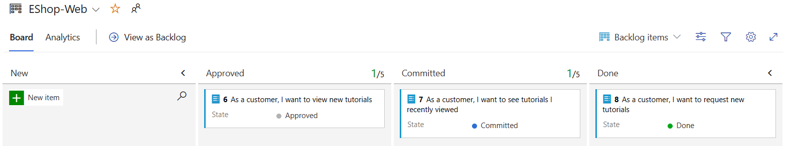
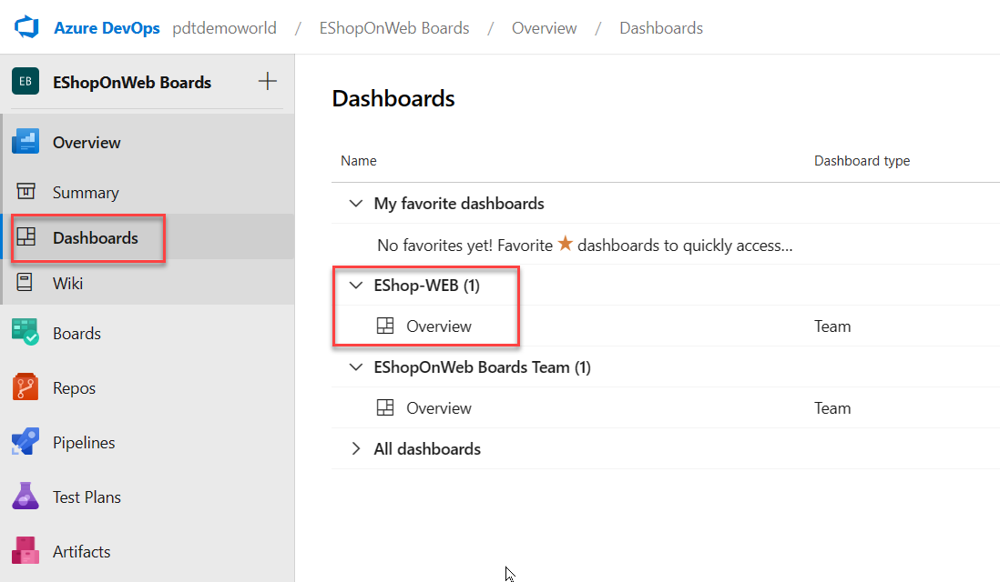

---
lab:
  title: Azure Boards를 사용하여 Agile 계획 및 포트폴리오 관리
  module: 'Module 01: Get started on a DevOps transformation journey'
---

# Azure Boards를 사용하여 Agile 계획 및 포트폴리오 관리

# 학생용 랩 매뉴얼

## 랩 요구 사항

- 이 랩은 **Microsoft Edge** 또는 [Azure DevOps 지원 브라우저](https://docs.microsoft.com/en-us/azure/devops/server/compatibility?view=azure-devops#web-portal-supported-browsers)가 필요합니다.

- **Azure DevOps 조직 설정:** 이 랩에 사용할 수 있는 Azure DevOps 조직이 아직 없으면 [조직 또는 프로젝트 컬렉션 만들기](https://docs.microsoft.com/en-us/azure/devops/organizations/accounts/create-organization?view=azure-devops)에서 제공되는 지침에 따라 조직을 만듭니다.

## 랩 개요

이 랩에서는 Azure Boards에서 제공하는 Agile 계획 및 포트폴리오 관리 도구와 프로세스에 대해 알아봅니다. 또한 전체 팀에서 이러한 도구 및 프로세스를 활용하여 작업을 신속하게 계획, 관리 및 추적할 수 있는 방법도 살펴봅니다. 반복 도중 작업 흐름을 추적할 수 있는 제품 백로그, 스프린트 백로그 및 작업 보드를 살펴봅니다. 또한 이 릴리스에서 대규모 팀 및 조직으로 확장되도록 향상된 도구도 살펴보겠습니다.

## 목표

이 랩을 완료하면 다음 작업을 수행할 수 있습니다.

- 팀, 영역 및 반복 관리.
- 작업 항목을 관리합니다.
- 스프린트 및 수용작업량 관리.
- Kanban 보드 사용자 지정.
- 대시보드 정의.
- 팀 프로세스 사용자 지정.

## 예상 소요 시간: 60분

## Instructions

### 연습 0: 랩 필수 구성 요소 구성

> **참고**: 이전 랩에서 이 프로젝트를 이미 만든 경우 이 연습을 건너뛸 수 있습니다.

이 연습에서는 랩의 필수 구성 요소를 설정합니다. 구체적으로는 [eShopOnWeb](https://github.com/MicrosoftLearning/eShopOnWeb)을 기반으로 하여 새 Azure DevOps 프로젝트와 리포지토리를 설정합니다.

#### 작업 1: (이미 완료된 경우 건너뛰기) 팀 프로젝트 만들기 및 구성

이 작업에서는 여러 랩에서 사용할 **eShopOnWeb** Azure DevOps 프로젝트를 만듭니다.

1. 랩 컴퓨터의 브라우저 창에서 Azure DevOps 조직을 엽니다. **새 프로젝트**를 클릭합니다. 프로젝트에 eShopOnWeb**이라는 이름을 **지정합니다. Private**을 표시 유형 옵션으로 정의**합니다.
2. 고급을 클릭하고 **스크럼**을 작업 항목 프로세스로 **지정**합니다**.**
 **만들기**를 클릭합니다.

    

### 연습 1: Agile 프로젝트 관리

이 연습에서는 Azure Boards를 사용하여 팀, 영역, 반복, 작업 항목, 스프린트 및 용량 관리, Kanban 보드 사용자 지정, 대시보드 정의 및 팀 프로세스 사용자 지정을 비롯한 다양한 일반적인 민첩한 계획 및 포트폴리오 관리 작업을 수행합니다.

#### 작업 1: 팀, 영역 및 반복 관리

이 작업에서는 새 팀을 만들고 해당 영역 및 반복을 구성합니다.

각 새 프로젝트는 프로젝트 이름과 일치하는 기본 팀으로 구성됩니다. 추가 팀을 만들 수 있습니다. 각 팀에 Agile 도구 및 팀 자산 제품군에 대한 액세스 권한을 부여할 수 있습니다. 여러 팀을 만들 수 있는 기능을 통해 기업 전체에서 자율성과 공동 작업 간의 적절한 균형을 유연하게 선택할 수 있습니다.

1. 웹 브라우저가 이전 연습에서 생성한 EShopOnWeb** 프로젝트를 사용하여 Azure DevOps 조직을 **표시하는지 확인합니다.

    > **참고**: 또는 자리 표시자가 계정 이름을 나타내는 [<https://dev.azure.com/>`<your-Azure-DevOps-account-name>`/EShopOnWeb) URL `<your-Azure-DevOps-account-name>` 로 이동하여 프로젝트 페이지에 직접 액세스할 수 있습니다.

2. 페이지의 왼쪽 아래 모서리에 있는 프로젝트 설정** 레이블이 지정된 **톱니바퀴 아이콘을 클릭하여 프로젝트 설정** 페이지를 엽니다**.

    

3. **일반** 섹션에서 Teams** 탭을 **선택합니다. 이 프로젝트에**는 이미 EShopOnWeb 팀이라는 기본 팀이** 있지만 이 랩에 대한 새 팀을 만듭니다. 새 팀을** 클릭합니다**.

    

4. 새 팀** 만들기 창**의 **팀 이름** 텍스트 상자에 EShop-Web**을 입력**하고 다른 설정을 기본값으로 그대로 두고 만들기**를 클릭합니다**.

    

5. Teams** 목록에서 **새로 만든 팀을 선택하여 세부 정보를 봅니다.

    > **참고**: 기본적으로 새 팀에는 사용자만 구성원으로 있습니다. 이 보기를 사용하여 팀 멤버 자격, 알림 및 대시보드와 같은 기능을 관리할 수 있습니다.

6. EShop-Web** 페이지의 맨 위에 **있는 반복 및 영역 경로** 링크를 클릭하여 **팀의 일정 및 범위를 정의하기 시작합니다.

    

7. 보드 창 위쪽에서 **반복** 탭을 **선택한 다음 **+ 반복** 선택**

    

8. EShopOnWeb\Sprint 1**을 선택하고 **저장 및 닫기를** 클릭합니다**. 이 첫 번째 스프린트는 반복 목록에 표시되지만 날짜는 아직 설정되지 않았습니다.
9. 스프린트 1을 선택하고 **줄임표(...)**를 클릭합니다**.** 상황에 맞는 메뉴에서 편집**을 선택합니다**.

     

    > **참고**: 시작 날짜를 지난 주의 첫 번째 작업일로 지정하고 각 스프린트의 전체 작업 주 3주를 계산합니다. 예를 들어 3월 6일이 스프린트의 첫 번째 작업일인 경우 3월 24일까지 진행됩니다. 스프린트 2는 3월 27일에 시작되며, 3월 6일부터 3주 동안 진행됩니다.

10. 이전 단계를 반복하여 스프린트 2** 및 스프린트 3**을 **추가**합니다. 현재 첫 번째 스프린트 2주차에 있다고 말할 수 있습니다.

    

11. 보드** 창으로 **돌아가서 창 위쪽에서 영역** 탭을 **선택합니다. 팀 이름과 일치하는 이름이 있는 자동으로 생성된 영역이 있습니다.
12. 기본 영역** 항목 옆에 있는 줄임표 기호(...)를 **클릭하고 드롭다운 목록에서 하위 영역** 포함을 선택합니다**.

    

    > **참고**: 모든 팀의 기본 설정은 하위 영역 경로를 제외하는 것입니다. 팀이 모든 팀의 모든 작업 항목을 볼 수 있도록 하위 영역을 포함하도록 변경합니다. 필요에 따라 관리 팀은 하위 영역을 포함하지 않도록 선택할 수도 있습니다. 이 하위 영역은 팀 중 하나에 할당되는 즉시 작업 항목을 보기에서 자동으로 제거합니다.

#### 작업 2: 작업 항목 관리

이 작업에서는 일반적인 작업 항목 관리 작업을 단계별로 수행합니다.

작업 항목은 Azure DevOps에서 중요한 역할을 합니다. 수행할 작업, 릴리스 장애, 테스트 정의 또는 기타 주요 항목을 설명하는지 여부에 관계없이 작업 항목은 최신 프로젝트의 핵심 요소입니다. 이 작업에서는 다양한 작업 항목을 사용하여 제품 교육 섹션을 사용하여 파트 무제한 사이트를 확장하도록 계획을 설정하는 데 집중합니다. 회사 제품의 상당 부분을 구축하는 것은 어려울 수 있지만 Azure DevOps 및 스크럼 프로세스는 매우 관리하기 쉽게 만듭니다.

> **참고**: 이 작업은 다양한 종류의 작업 항목을 만들 수 있는 다양한 방법을 설명하고 플랫폼에서 사용할 수 있는 다양한 기능을 보여 주도록 설계되었습니다. 따라서 이러한 단계는 프로젝트 관리를 위한 규범적인 지침으로 간주해서는 안 됩니다. 이 기능은 프로세스 요구 사항에 맞게 유연하게 사용할 수 있도록 되므로 탐색하고 실험해 보세요.

1. Azure DevOps 포털의 세로 탐색 창에서 보드** 아이콘을 **선택하고 작업 항목을** 선택합니다**.

    > **참고**: Azure DevOps에서 작업 항목을 만드는 방법에는 여러 가지가 있으며, 그 중 몇 가지를 살펴보겠습니다. 때로는 대시보드에서 하나를 발사하는 것만큼 간단합니다.

2. 작업 항목** 창에서 ****+ 새 작업 항목 > 에픽**을 클릭합니다.

    

3. **Enter 제목** 텍스트 상자에 Product Training**을 입력**합니다.
4. 왼쪽 위 모서리에서 할당**되지 않은 항목을 선택하고 **드롭다운 목록에서 사용자 계정을 선택하여 새 작업 항목을 자신에게 할당합니다.
5. 영역 항목 옆에 있는 **eShopOnWeb** 항목을 선택하고 **드롭다운 목록에서 EShop-WEB**을 선택합니다**.** 그러면 영역****이 **eShopOnWeb\EShop-WEB**으로 설정됩니다.
6. 반복 항목 옆에 있는 **eShopOnWeb** 항목을 선택하고 **드롭다운 목록에서 스프린트 2**를 선택합니다**.** 그러면 반복****이 **eShopOnWeb\Sprint 2**로 설정됩니다.
7. **저장** 을 클릭하여 변경을 마무리합니다. **닫**지 마세요.

    

    > **참고**: 일반적으로 가능한 한 많은 정보를 작성하려고 하지만 이 랩의 용도로 충분합니다.

    > **참고**: 작업 항목 양식에는 모든 관련 작업 항목 설정이 포함됩니다. 여기에는 할당된 사용자, 여러 매개 변수의 상태, 생성 이후 처리된 방법에 대한 모든 관련 정보 및 기록이 포함됩니다. 집중해야 할 주요 영역 중 하나는 관련 작업**입니다**. 이 서사시에 기능을 추가하는 방법 중 하나를 살펴보겠습니다.

8. 오른쪽 **관련 작업** 섹션에서 **링크 추가** 항목을 선택하고 드롭다운 목록에서 **새 항목**을 선택합니다.
9. 링크 추가 패널의 **[링크** 유형 **] 드롭다운 목록에서 [자식 **]을 선택합니다**.** 다음으로 작업 **항목 유형** 드롭다운 목록에서 기능을** 선택하고 **제목** 텍스트 상자에서 **학습 대시보드**를 입력**하고 확인을** 클릭합니다**.

    

    > **참고**: 학습 대시보드** 패널에서 **할당, **영역** 및 반복**은 이미 기능의 기반이 되는 에픽과 **동일한 값으로 설정되어 있습니다. 또한 이 기능은 생성된 부모 항목에 자동으로 연결됩니다.

10. 학습 대시보드** 패널에서 **저장 및 닫기를** 클릭합니다**.

    

1. Azure DevOps 포털의 세로 탐색 창에 있는 **Boards** 항목 목록에서 **Boards**를 선택합니다.
1. **Boards** 창에서 **PUL-Web 보드** 항목을 선택합니다. 그러면 해당 팀의 보드가 열립니다.

    

1. **Boards** 패널 오른쪽 위에서 **백로그 항목**을 선택하고 드롭다운 목록에서 **기능**을 선택합니다.

    > **참고**: 이 단계를 수행하면 기능에 작업 및 기타 작업 항목을 쉽게 추가할 수 있습니다.

1. **교육 대시보드** 기능을 나타내는 사각형 위에 마우스 포인터를 올립니다. 그러면 오른쪽 위에 줄임표 기호가 나타납니다.
1. 줄임표 아이콘을 클릭하고 드롭다운 목록에서 **제품 백로그 항목 추가**를 선택합니다.

    

16. 새 제품 백로그 항목의 텍스트 상자에 고객으로 입력**합니다. 새 자습서를** 보고 Enter** 키를 눌러 **항목을 저장하려고 합니다.

    > **참고**: 기능의 자식이고 해당 영역과 반복을 공유하는 새 제품 백로그 항목(PBI) 작업 항목을 만듭니다.

17. 이전 단계를 반복하여 고객이 최근에 본 자습서를 보고 각각 명명된 **새 자습서를 요청할 수 있도록 설계된 두 개의 PPI를 추가합니다. 고객으로서 최근에 본** 자습서를 보고 싶고 **고객으로서 새 자습서를 요청하려고 합니다**.

    

18. 보드 패널의 **오른쪽 위 모서리에서 기능** 항목을 선택하고 **드롭다운 목록에서 백로그 항목을** 선택합니다**.**

     

    > **참고**: 백로그 항목에는 완료를 기준으로 하는 위치를 정의하는 상태가 있습니다. 양식을 사용하여 작업 항목을 열고 편집할 수 있지만 보드에서 카드 끌기만 하면 됩니다.

19. **EShop-WEB** 패널의 **보드** 탭에서 고객으로 명명된 **첫 번째 작업 항목을 끌어서 새로** 만들기에서 승인된** 단계로 새 **자습서**를 **보려고 합니다.

    

    > **참고**: 작업 항목 카드 확장하여 편리하게 편집 가능한 세부 정보를 얻을 수도 있습니다.

20. 승인**된 스테이지로 이동한 작업 항목을 나타내는 직사각형 위에 마우스 포인터를 **놓습니다. 그러면 아래쪽을 향한 캐리트 기호가 표시됩니다.
21. 아래쪽을 향한 캐리트 기호를 클릭하여 작업 항목 카드 확장하고, 할당**되지 않은 항목을 선택하고**, 사용자 계정 목록에서 이동된 PBI를 자신에게 할당할 계정을 선택합니다.
22. **EShop-WEB** 패널의 **보드** 탭에서 고객으로 명명된 **두 번째 작업 항목을 끕니다. 최근에 새로 **** 만들기에서 **커밋**된** 단계로 본 자습서를 보고 싶습니다.
23. EShop-WEB** 패널의 **보드** 탭에서 고객으로 명명된 **세 번째 작업 항목을 끌어 새로 만들기 단계에서 **** 완료 단계로 새 자습서**를 **요청하려고 합니다**.**

    

    > **참고**: 작업 보드는 백로그에 대한 하나의 보기입니다. 테이블 형식 보기를 사용할 수도 있습니다.

24. EShop-WEB** 창의 **보드** 탭에서 창 맨 위에 있는 [백로그**로 보기]를 클릭하여 **테이블 형식을 표시합니다.**

    

    > **참고**: EShop-WEB** 패널의 백로그** 탭 레이블 바로 아래에 **더하기 기호를 **사용하여 이러한 작업 항목 아래에 중첩된 작업을 볼 수 있습니다.

    > **참고**: 첫 번째 백로그 항목에 직접 왼쪽에 있는 두 번째 더하기 기호를 사용하여 새 작업을 추가할 수 있습니다.

25. **EShop-WEB** 창의 **백로그** 탭에서 창의 왼쪽 위 모서리에 있는 첫 번째 작업 항목 옆에 있는 위쪽에서 두 번째 더하기 기호를 클릭합니다. 그러면 새 작업** 패널이 **표시됩니다.

    

26. 새 작업 패널의 **맨 위에 있는 **Enter 제목** 텍스트 상자에 최신 자습서의 추가 페이지를 입력**합니다**.**
27. 새 작업 패널의 **Re기본ing Work** 텍스트 상자에 5**를 입력**** 합니다.**
28. 새 작업 패널의 ****작업** 드롭다운 목록에서 개발을** 선택합니다**.**
29. 새 작업** 패널에서 **저장 및 닫기를** 클릭합니다**.

    

30. 마지막 5단계를 반복하여 최신 자습서에 대해 데이터 쿼리 최적화라는 **다른 작업을 추가합니다**. Re**기본ing Work**를 3**으로 **설정하고 해당 **작업을** 디자인**으로 **설정합니다. 완료되면 저장 및 닫기를** 클릭합니다**.

#### 작업 3: 스프린트 및 용량 관리

이 작업에서는 일반적인 스프린트 및 용량 관리 작업을 단계별로 수행합니다.

팀은 일반적으로 스프린트 첫날에 열리는 스프린트 계획 회의 중에 스프린트 백로그를 작성합니다. 각 스프린트는 Agile 프로세스 및 도구를 사용하여 작업하는 팀의 기능을 지원하는 시간 상자 간격에 해당합니다. 계획 회의 중에 제품 소유자는 팀과 협력하여 스프린트에서 완료할 스토리 또는 백로그 항목을 식별합니다.

모임 계획은 일반적으로 두 부분으로 구성됩니다. 첫 번째 부분에서 팀과 제품 소유자는 이전 스프린트에 대한 경험을 기반으로 스프린트에서 완료하기 위해 팀이 커밋할 수 있다고 느끼는 백로그 항목을 식별합니다. 이러한 항목은 스프린트 백로그에 추가됩니다. 두 번째 부분에서 팀은 각 항목을 개발하고 테스트하는 방법을 결정합니다. 그런 다음 각 항목을 완료하는 데 필요한 작업을 정의하고 예측합니다. 마지막으로 팀은 이러한 예상을 기반으로 일부 또는 모든 항목을 구현하도록 커밋합니다.

스프린트 백로그에는 팀이 성공적으로 계획하고 완료하는 데 필요한 모든 정보가 포함되어야 하며, 마지막에 서두르지 않고도 할당된 시간 내에 작업을 완료해야 합니다. 스프린트를 계획하기 전에 백로그를 만들고, 우선 순위를 지정하고, 예측하고, 스프린트를 정의하려고 합니다.

1. Azure DevOps 포털의 세로 탐색 창에서 보드 아이콘을 **선택하고 보드**** 항목 목록에서 **스프린트를** 선택합니다**.
2. 스프린트 보기의 **작업판** 탭에 있는 도구 모음의 오른쪽에 있는 보기 옵션** 기호(깔때기형 아이콘의 왼쪽에 직접)**를 선택하고 **보기 옵션** 드롭다운 목록에서 작업 세부 정보** 항목을 선택합니다**.** ** 

    

    > **참고**: 현재 스프린트의 범위는 매우 제한적입니다. 할 일 단계에는 두 가지 작업이 **있습니다** . 이 시점에서는 두 작업이 모두 할당되지 않았습니다. 둘 다 다시 기본 작업 예상을 나타내는 할당**되지 않은 항목의 **오른쪽에 숫자 값을 표시합니다.

3. **최신 자습서용 페이지 추가**를 나타내는 사각형에서 **할당되지 않음** 항목을 클릭하고 사용자 계정 목록에서 자신의 계정을 선택하여 작업을 자신에게 할당합니다.

4. **스프린트 보기의 용량** 탭을 **** 선택합니다.

    > **참고**: 이 보기를 사용하면 사용자가 수행할 수 있는 활동과 용량 수준을 정의할 수 있습니다.

5. **스프린트** 보기의 **용량** 탭에 있는 작업** 레이블 바로 아래**의 **할당**되지 않은 드롭다운 목록에서 개발을 **** 선택하고 **일일** 용량 텍스트 상자에 1**을 입력**합니다.

    > **참고**: 하루에 1시간의 개발 작업을 나타냅니다. 개발 이상의 작업을 수행하는 경우 사용자당 추가 활동을 추가할 수 있습니다.

    > **참고**: 휴가를 가겠다고 가정해 보겠습니다.

6. **스프린트** 보기의 **용량** 탭에서 사용자 계정을 나타내는 항목 바로 옆에 있는 일**수 열에서 **0일** 항목을 클릭합니다**. 그러면 쉬는 날을 설정할 수 있는 패널이 표시됩니다.
7. 표시된 패널에서 일정 보기를 사용하여 현재 스프린트(다음 3주 이내)에 5일 동안 휴가를 설정하고 완료되면 확인을** 클릭합니다**.

    

8. 스프린트 보기의 **용량** 탭으로 **돌아가서 저장**을 클릭합니다**.**
9. 스프린트 보기의 **작업표** 탭을 **** 선택합니다.

    

    > **참고**: 사용 가능한 대역폭을 **반영하도록 작업 세부 정보** 패널이 업데이트되었습니다. 작업 세부 정보** 패널에 **표시되는 실제 숫자는 다를 수 있지만 총 스프린트 용량은 하루에 1시간을 할당했기 때문에 스프린트가 끝날 때까지 다시 기본 작업일 수와 같습니다. 이 값은 이후 단계에서 사용되므로 기록해 둡습니다.

    > **참고**: 보드의 편리한 기능 중 하나는 키 데이터를 인라인으로 쉽게 업데이트할 수 있다는 것입니다. 각 작업에 필요한 시간을 반영하도록 Re기본ing Work** 예상을 정기적으로 업데이트**하는 것이 좋습니다. **최신 자습서용 페이지 추가** 작업을 검토한 결과 원래 예상보다 더 오래 걸릴 것으로 보인다고 가정해 보겠습니다.

10. **스프린트** 보기의 **작업 보드** 탭에서 가장 최근 자습서**의 추가 페이지를 나타내는 **사각형 상자에서 이전 단계에서 식별한 이 스프린트의 총 용량과 일치하도록 예상 시간 **수를 14**로 설정합니다.

    

    > **참고**: 이렇게 하면 개발** 및 개인 용량이 자동으로 최대로 확장**됩니다. 할당된 작업을 처리할 수 있을 만큼 크므로 녹색으로 유지됩니다. 그러나 가장 최근 자습서 작업에 대한 데이터 최적화 쿼리에 필요한 **추가 3시간으로 인해 전체 **팀** 용량이 초과되었습니다**.

    > **참고**: 이 용량 문제를 해결하는 한 가지 방법은 작업을 향후 반복으로 이동하는 것입니다. 이 작업을 수행할 수 있는 몇 가지 방법이 있습니다. 예를 들어 여기에서 작업을 열고 작업 세부 정보에 대한 액세스를 제공하는 패널 내에서 편집할 수 있습니다. 또 다른 방법은 인라인 메뉴 옵션을 제공하는 백로그** 보기를 사용하여 **이동하는 것입니다. 하지만 이 시점에서는 작업을 아직 이동하지 마세요.

11. 스프린트 보기의 **작업판** 탭에 있는 도구 모음의 오른쪽에 있는 보기 옵션** 기호(깔때기형 아이콘의 왼쪽에 직접)를 선택하고 **보기 **옵션** 드롭다운 목록에서 사람** 항목을 선택합니다**.** ** 

    > **참고**: 백로그 항목 대신 사용자가 작업 진행률을 검토할 수 있도록 보기를 조정합니다.

    > **참고**: 사용 가능한 사용자 지정도 많이 있습니다.

12. **팀 설정** 구성 코그 휠 아이콘(깔때기형 아이콘 오른쪽)을 클릭합니다.
13. 설정** 패널에서 **스타일** 탭을 선택하고 **+ 스타일 지정 규칙을** 클릭하고 **규칙 이름** 레이블 **아래**의 이름** 텍스트 상자에 Development**를 입력**하고 **카드 색** 드롭다운 목록에서 녹색 사각형을 선택합니다.

    > **참고**: 규칙 조건** 섹션에서 바로 아래에 **설정된 규칙 조건을 충족하는 경우 모든 카드 녹색으로 표시됩니다.

14. **규칙 기준** 섹션의 **필드** 드롭다운 목록에서 **활동**을 선택하고 **연산자** 드롭다운 목록에서 **=** 를, **값** 드롭다운 목록에서 **개발**을 선택합니다.

    

    > **참고**: 이렇게 하면 개발** 활동에 할당된 모든 카드 녹색으로 **설정됩니다.

15. 설정** 패널에서 **백로그 탭을 **** 선택합니다.

    > **참고**: 이 탭의 항목을 사용하면 탐색에 사용할 수 있는 수준을 설정할 수 있습니다. 에픽은 기본적으로 포함되지 않지만 변경할 수 있습니다.

16. 설정** 패널에서 **작업일** 탭을 **선택합니다.

    > **참고**: 이 탭의 항목을 사용하면 팀이 따르는 작업일**을 지정할 **수 있습니다. 이는 용량 및 번다운 계산에 적용됩니다.

17. 설정** 패널에서 **버그 작업 **탭을** 선택합니다.

    > **참고**: 이 탭의 항목을 사용하면 보드에 버그가 표시되는 방법을 지정할 수 있습니다.

18. 설정 패널에서 **저장을 클릭하고 닫기를** 클릭하여 **스타일 지정 규칙을 저장**합니다.

    > **참고**: 개발**과 **관련된 작업은 이제 녹색이며 식별하기가 매우 쉽습니다.

#### 작업 4: Kanban 보드 사용자 지정

이 작업에서는 Kanban 보드를 사용자 지정하는 프로세스를 단계별로 안내합니다.

고품질 소프트웨어를 지속적으로 제공하는 팀의 능력을 최대화하기 위해 Kanban은 두 가지 기본 사례를 강조합니다. 첫 번째 작업 흐름을 시각화하려면 팀의 워크플로 스테이지를 매핑하고 일치하도록 Kanban 보드를 구성해야 합니다. 두 번째로 진행 중인 작업량을 제한하려면 WIP(작업 진행 중) 제한을 설정해야 합니다. 그런 다음 Kanban 보드에서 진행 상황을 추적하고 주요 메트릭을 모니터링하여 잠재 고객 또는 주기 시간을 줄일 준비가 된 것입니다. Kanban 보드는 백로그를 대화형 게시판으로 전환하여 시각적 작업 흐름을 제공합니다. 아이디어에서 완료까지 작업이 진행됨에 따라 보드의 항목을 업데이트합니다. 각 열은 작업 단계를 나타내며, 각 카드 해당 작업 단계에서 사용자 스토리(파란색 카드) 또는 버그(빨간색 카드)를 나타냅니다. 그러나 모든 팀은 시간이 지남에 따라 자체 프로세스를 개발하므로 팀의 작동 방식에 맞게 Kanban 보드를 사용자 지정하는 기능은 성공적인 전달에 매우 중요합니다.

1. Azure DevOps 포털의 세로 탐색 창에서 보드 항목 목록에서 **보드****를 선택합니다**.
2. 보드 패널에서 **팀 설정** 구성 코그 휠 아이콘(깔때기형 아이콘 오른쪽)을 클릭합니다**.**

    > **참고**: 팀은 데이터로 수행된 작업을 강조하므로 데이터 액세스 또는 저장과 관련된 모든 작업에 특별한 주의가 필요합니다.

3. 설정 패널에서 **[태그 색 **] 탭을 선택하고 **[ 태그] 텍스트 상자에서** **[태그] 색**을 클릭하고 **데이터를** 입력**하고 기본 색을 그대로 둡니다.**

    

    > **참고**: 백로그 항목 또는 버그에 데이터** 태그**가 지정될 때마다 해당 태그가 강조 표시됩니다.

4. 설정** 패널에서 **주석 탭을 **** 선택합니다.

    > **참고**: 더 쉽게 읽고 탐색할 수 있도록 카드 포함할 주석**을 지정할 **수 있습니다. 주석을 사용하도록 설정하면 각 카드 시각화를 클릭하여 해당 형식의 자식 작업 항목에 쉽게 액세스할 수 있습니다.

5. **설정** 패널에서 테스트 탭을 **** 선택합니다.

    > **참고**: **테스트** 탭을 사용하면 카드 테스트가 표시되고 동작하는 방식을 구성할 수 있습니다.

6. 설정 패널에서 **저장을 클릭하고 닫기를** 클릭하여 **스타일 지정 규칙을 저장**합니다.
7. **EShop-WEB** 패널의 **보드** 탭에서 고객으로서를 **나타내는 작업 항목을 마우스 오른쪽 단추로 클릭하고 새 자습서** 백로그 항목을 보고 열기**를 선택**하려고 합니다.
8. **고객으로서 패널 맨 위에 있는 0개의** 주석** 항목 오른쪽**에 있는 새 자습서 패널을 보려면 태그** 추가를 클릭합니다**.
9. 결과 텍스트 상자에 데이터를** 입력**하고 Enter** 키를 누릅니**다.
10. 이전 단계를 반복하여 ux** 태그를 추가합니다**.
11. **고객으로서 새 자습서** 패널을 보려면 저장 및 닫기를** 클릭합니다**.

    

    > **참고**: 이제 두 태그가 카드 표시되고 구성된 대로 데이터** 태그가 **노란색으로 강조 표시됩니다.

12. 보드 패널에서 **팀 설정** 구성 코그 휠 아이콘(깔때기형 아이콘 오른쪽)을 클릭합니다**.**
13. **설정** 패널에서 열 탭을 **** 선택합니다.

    > **참고**: 이 섹션에서는 워크플로에 새 단계를 추가할 수 있습니다.

14. + 열을 클릭하고 **열 이름** 레이블 아래**의 **이름** 텍스트 상자에 QA Approved**를 입력**하고 **WIP 제한** 텍스트 상자에 1을 입력**합니다.****

    > **참고**: 진행 중인 작업 시간 제한이 1이면 한 번에 하나의 작업 항목만 이 단계에 있어야 합니다. 일반적으로 이 값을 더 높게 설정하지만 이 기능을 보여 주는 작업 항목은 두 개뿐입니다.

15. 설정 패널의 ****열** 탭에서 새로 만든 탭을 커밋**된 탭과 **완료 사이에 **끌어서 놓습니다**.**
16. 설정 패널에서 **저장을 클릭하고 **닫습니다**.**

    

    > **참고**: 이제 워크플로에 새 단계가 표시되는지 확인합니다.

17. **보드 포털**을 새로 고치**면 **이제 QA 승인**4 열이 Kanban 보드 보기에 **표시됩니다.
18. **고객으로 끌어다 놓으면 최근에 커밋**된** 단계에서 QA 승인** 스테이지로 작업 항목을 **본 자습서를 **확인하려고 합니다.
19. **승인됨** 단계의 **고객용 신규 자습서 확인 요망** 작업 항목도 **QA 승인됨** 단계로 끌어서 놓습니다.

    

    > **참고**: 이제 스테이지가 WIP** 제한을 초과**하고 경고로 빨간색으로 표시됩니다.

20. **고객으로 이동하면 최근에 백로그 항목을 커밋으로** 다시 본 자습서를 확인하려고 합니다****.
21. 보드 패널에서 **팀 설정** 구성 코그 휠 아이콘(깔때기형 아이콘 오른쪽)을 클릭합니다**.**
22. 설정** 패널에서 **** 열** 탭으로 돌아가서 QA 승인 탭을 **** 선택합니다.

    > **참고**: 작업이 열로 이동되는 시기와 작업이 시작되는 시점 사이에 지연이 발생하는 경우가 많습니다. 해당 지연에 대응하고 진행 중인 작업의 실제 상태를 표시하려면 분할 열을 켤 수 있습니다. 분할할 때 각 열에는 수행** 및 **완료**라는 두 개의 하위 열이 포함됩니다**. 열을 분할하면 팀에서 끌어오기 모델을 구현할 수 있습니다. 분할 열이 없으면 팀은 작업 단계를 완료했음을 알리기 위해 작업을 진행합니다. 그러나 다음 단계로 푸시한다고 해서 팀 구성원이 해당 항목에 대한 작업을 즉시 시작하는 것은 아닙니다.

23. QA 승인 탭**에서 **분할 열을 사용하도록 설정하고 **검사box를 수행**하여 두 개의 개별 열을 만듭니다.

    > **참고**: 팀이 한 단계에서 다음 단계로 진행되는 작업의 상태 업데이트할 때 수행의 **** 의미에 동의하는 데 도움이 됩니다. 각 Kanban 열에 대한 완료** 조건 정의를 지정**하면 항목을 다운스트림 단계로 이동하기 전에 완료해야 하는 필수 작업을 공유할 수 있습니다.

24. **QA 승인됨** 탭에서 창 아래쪽에 있는 **완료 정의** 텍스트 상자에 **\*\*모든\*\* 테스트 통과**를 입력합니다.
25. 설정 패널에서 **저장을 클릭하고 **닫습니다**.**

    

    > **참고**: **QA 승인** 단계에는 **이제 실행** 및 **완료** 열이 있습니다. 열 머리글 옆에 있는 정보 기호(원 안에 문자 **i** 포함)를 클릭하여 완료** 정의를 읽을 **수도 있습니다.

26. 보드 패널에서 **팀 설정** 구성 코그 휠 아이콘(깔때기형 아이콘 오른쪽)을 클릭합니다**.**

    > **참고**: Kanban 보드는 새로 만들기에서 완료로 이동할 때 작업 흐름을 시각화하는 기능을 지원합니다. 스윔 레인을** 추가할 **때 다양한 서비스 수준 클래스를 지원하는 작업의 상태 시각화할 수도 있습니다. 추적 요구 사항을 지원하는 다른 차원을 나타내는 스윔 레인을 만들 수 있습니다.

27. 설정** 패널에서 **스윔 레인 탭을 **** 선택합니다.
28. 스윔 레인 탭의 **스윔 레인** 이름** 레이블 바로 아래에 **있는 **[이름**] 텍스트 상자에 [Expedite **]를 입력**** 합니다.**
29. 설정 패널에서 **저장을 클릭하고 **닫습니다**.**

    

30. **보드** 패널의 **보드** 탭으로 돌아가서 **커밋됨** 작업 항목을 QA 대역폭을 사용할 수 있게 될 때 우선 순위가 있는 것으로 인식되도록 **신속** 스윔 레인의 **QA 승인됨\| 작업** 단계로 끌어서 놓습니다.

    > **참고**: 더 많은 작업 항목**이 있는 보다 정교한 보드를 검토하려면 보드** 패널의 **보드** 탭에서 왼쪽 위 모서리에 있는 EShop-WEB**을 선택하고 **팀 드롭다운 목록에서 eShopOnWeb 팀을** 선택합니다**. 이 보드는 결과를 실험하고 검토할 수 있는 놀이터를 제공합니다.

#### 작업 5: 팀 프로세스 사용자 지정

이 작업에서는 사용자 지정 스크럼 기반 프로세스를 만듭니다. 프로세스에는 독점적인 eShopOnWeb 티켓 ID로 추적하도록 설계된 백로그 항목 필드가 포함됩니다.

Azure DevOps에서는 프로세스를 통해 작업 추적 환경을 사용자 지정합니다. 프로세스는 Azure DevOps를 통해 액세스하는 다른 하위 시스템뿐만 아니라 작업 항목 추적 시스템의 구성 요소를 정의합니다. 팀 프로젝트를 만들 때마다 프로젝트에 원하는 구성 요소를 포함하는 프로세스를 선택합니다. Azure DevOps는 두 가지 프로세스 유형을 지원합니다. 첫째, 핵심 시스템 프로세스(스크럼, Agile 및 CMMI)는 읽기 전용이므로 사용자 지정할 수 없습니다. 두 번째 유형의 상속된 프로세스는 해당 설정을 사용자 지정하는 옵션을 사용하여 핵심 시스템 프로세스를 기반으로 만듭니다.

모든 프로세스는 동일한 조직 내에서 공유됩니다. 즉, 하나 이상의 팀 프로젝트가 단일 프로세스를 참조할 수 있습니다. 단일 팀 프로젝트를 사용자 지정하는 대신 프로세스를 사용자 지정합니다. 프로세스를 변경하면 해당 프로세스를 참조하는 모든 팀 프로젝트가 자동으로 업데이트됩니다. 상속된 프로세스를 만든 후에는 해당 프로세스를 사용자 지정하고, 이를 기반으로 팀 프로젝트를 만들고, 기존 팀 프로젝트를 마이그레이션하여 참조할 수 있습니다. Git 팀 프로젝트는 상속된 프로세스로 마이그레이션될 때까지 사용자 지정할 수 없습니다.

1. Azure DevOps 페이지에서 왼쪽 위 모서리에 있는 Azure DevOps** 로고를 클릭하여 **계정 루트 페이지로 이동합니다.
2. 페이지의 왼쪽 아래 모서리에서 조직 설정을** 클릭합니다**.
3. **조직 설정** 세로 메뉴의 **보드** 섹션에서 프로세스를** 선택합니다**.
4. 모든 프로세스 창의 ****스크럼** 항목 오른쪽에서 줄임표 기호(...)를 선택하고 드롭다운 메뉴에서 상속된 프로세스** 만들기를 선택합니다**.**

    

5. 스크럼 패널에서 **상속된 프로세스 만들기 패널의 **프로세스 이름(필수)** 텍스트 상자에 사용자 지정된 스크럼**을 입력**하고 프로세스** 만들기를 클릭합니다**.**
6. 모든 프로세스 창으로 **돌아가서 사용자 지정된 스크럼** 항목을 클릭합니다**.**

    > **참고**: 새 프로세스가 표시되도록 브라우저를 새로 고쳐야 할 수 있습니다.

7. **모든 프로세스 > 사용자 지정된 스크럼** 창에서 제품 백로그 항목을** 선택합니다**.

    

8. **사용자 지정된 스크럼 > 제품 백로그 항목** 창에 > 모든 프로세스에서 새 필드를** 클릭합니다**.
9. **제품 백로그 항목**에 필드 추가 패널의 **정의** 탭에 있는 필드** 만들기 섹션**의 **이름** 텍스트 상자에 EShop 티켓 ID**를 입력**합니다.

    

10. **제품 백로그 항목**에 필드 추가 패널에서 레이아웃**을 클릭합니다**.
11. **제품 백로그 항목**에 필드 추가 패널의 **레이아웃** 탭에 있는 **레이블** 텍스트 상자에 티켓 ID**를 입력**하고 새 그룹** 만들기 옵션을 **선택하고 **그룹** 텍스트 상자에 EShopOnWeb**을 입력**하고 추가 필드를** 클릭합니다**.

    

    > **참고**: 이제 사용자 지정된 프로세스가 구성되었으므로 사용하도록 eShopOnWeb 프로젝트로 전환해 보겠습니다.

12. 모든 프로세스** > **사용자 지정된 스크럼 > 제품 백로그 항목** 창의 **맨 위에 있는 이동 경로 경로를 사용하여 모든 프로세스 루트로 돌아갑니다.
13. 모든 프로세스** 창에서 **스크럼** 항목을 선택합니다**.

    

    > **참고**: 현재 프로젝트에서는 스크럼**을 사용합니다**.

14. **모든 프로세스 > 스크럼** 창에서 프로젝트** 탭을 **선택합니다.
15. 프로젝트 목록에서 eShopOnWeb** 항목이 **포함된 행에서 줄임표 기호(...)를 선택한 다음 변경 프로세스를** 선택합니다**.
16. 프로젝트 프로세스** 변경 창**의 **대상 프로세스** 선택 드롭다운 목록에서 사용자 지정된 스크럼** 프로세스를 선택하고 **저장**을 클릭한 **다음 닫기를** 클릭합니다**.

    

17. **왼쪽 위 모서리에 있는 Azure DevOps** 로고를 클릭하여 계정 루트 페이지로 돌아갑니다.
18. 프로젝트 탭에서 **eShopOnWeb** 프로젝트를 나타내는 **항목을** 선택합니다.
19. eShopOnWeb** 페이지의 왼쪽에 있는 세로 **메뉴에서 보드**를 선택하고 **작업 항목** 창이 **표시되는지 확인합니다.
20. 작업 항목 목록에서 첫 번째 백로그 항목을 클릭합니다.
21. 이제 **프로세스 사용자 지정 중에 정의된 eShopOnWeb** 그룹 아래에 **티켓 ID** 필드가 있는지 확인합니다. 다른 텍스트 필드처럼 처리할 수 있습니다.

    

    > **참고**: 작업 항목이 저장되면 Azure DevOps는 쿼리 및 Azure DevOps의 나머지 부분을 통해 사용할 수 있도록 새 사용자 지정 정보도 저장합니다.

### 연습 2(선택 사항) : 대시보드 정의

이 작업에서는 대시보드 및 해당 핵심 구성 요소를 만드는 프로세스를 단계별로 안내합니다.

대시보드를 사용하면 팀이 상태 시각화하고 프로젝트 전체의 진행 상황을 모니터링할 수 있습니다. 팀 프로젝트 사이트의 다른 부분으로 드릴다운하지 않고도 정보에 입각한 결정을 내릴 수 있습니다. 개요 페이지에서는 타일을 추가, 제거 또는 다시 정렬하여 사용자 지정할 수 있는 기본 팀 대시보드에 대한 액세스를 제공합니다. 각 타일은 하나 이상의 기능 또는 함수에 대한 액세스를 제공하는 위젯에 해당합니다.

1. Azure DevOps 포털의 세로 탐색 창에서 개요** 아이콘을 **선택하고 개요** 항목 목록에서 **대시보드를** 선택합니다**.
2. 필요한 경우 대시보드 창의 **왼쪽 위 모서리에 있는 **eShopOnWeb 팀 섹션에서 eShopOnWeb 팀** - 개요**를 선택하고 **기존 대시보드를 검토**합니다.

    

3. 대시보드 창에서 **eShopOnWeb 팀 - 개요** 제목 옆에 있는 **드롭다운 메뉴를 선택하고 + 새 대시보드**를 선택합니다**.**

    

4. 대시보드** 만들기 창**의 **이름** 텍스트 상자에 제품 교육을 ****입력**하고 팀** 드롭다운 목록에서 EShop-WEB** 팀을 선택하고 **만들기**를 클릭합니다**.

    

5. 새 대시보드 창에서 위젯** 추가를 클릭합니다**.
6. 위젯** 추가 패널**의 **검색** 텍스트 상자에 스프린트를 입력**하여 스프린트**에 초점을 맞춘 기존 위젯을 찾습니다. 결과 목록에서 스프린트 개요**를 선택하고 **추가**를 클릭합니다**.
7. 새로 추가된 위젯을 나타내는 사각형에서 설정** 톱니바퀴 아이콘을 클릭하고 **구성** 창을 검토**합니다.

    > **참고**: 사용자 지정 수준은 위젯에 따라 달라집니다.

8. 구성** 창에서 **변경하지 않고 닫기를** 클릭합니다**.
9. **위젯** 추가 창**으로 돌아가서 검색** 텍스트 상자에 스프린트를 다시 입력**하여 스프린트**에 초점을 맞춘 기존 위젯을 찾습니다. 결과 목록에서 스프린트 용량**을 선택하고 **추가**를 클릭합니다**.
10. 대시보드 보기의 **창 위쪽에서 편집** 완료를 클릭합니다**.**

    

    > **참고**: 이제 사용자 지정 대시보드에서 현재 스프린트의 두 가지 중요한 측면을 검토할 수 있습니다.

    > **참고**: 대시보드를 사용자 지정하는 또 다른 방법은 대시보드에 공유할 수 있는 작업 항목 쿼리를 기반으로 차트를 생성하는 것입니다.

11. Azure DevOps 포털의 세로 탐색 창에서 보드** 아이콘을 **선택하고 보드** 항목 목록에서 **쿼리를** 선택합니다**.
12. 쿼리 창에서 **+ 새 쿼리**를 클릭합니다**.**
13. **쿼리 > 내 쿼리** 창의 **편집기** 탭에 있는 **작업 항목 유형** 행의 **값** 드롭다운 목록에서 작업을** 선택합니다**.
14. **쿼리 > 내 쿼리** 창의 **편집기** 탭에 있는 두 번째 행의 필드** 열에서 **영역 경로를** 선택하고 **해당 **값** 드롭다운 목록에서 eShopOnWeb\\EShop-WEB**을 선택합니다**.
15. 쿼리** 저장을 클릭합니다**.

    

16. **새 쿼리** 패널의 **이름 입력** 텍스트 상자에 **웹 작업**을 입력합니다. 그런 다음 **폴더** 드롭다운 목록에서 **공유 쿼리**를 선택하고 **확인**을 클릭합니다.
17. 차트 탭을 **선택하고 + 새 차트**를 클릭합니다**.**
18. [차트** 구성] 패널의 ****[이름]** 텍스트 상자에 **[웹 작업] - [할당** 기준] **** 드롭다운 목록에서 [할당 대상]**을 선택하고 **[확인 **]을 클릭하여 **변경 내용을 저장합니다.

    

    > **참고**: 이제 대시보드에 이 차트를 추가할 수 있습니다.

## 검토

이 랩에서는 Azure Boards를 사용하여 팀, 영역, 반복, 작업 항목, 스프린트 및 용량 관리, Kanban 보드 사용자 지정, 대시보드 정의 및 팀 프로세스 사용자 지정을 비롯한 다양한 일반적인 민첩한 계획 및 포트폴리오 관리 작업을 수행했습니다.
